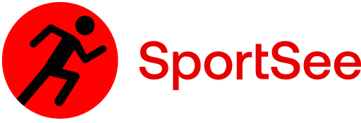

  

# Projet 12 - SportSee - OpenClassrooms

SportSee is a project to create a page for sport coaching. The user can follow all informations about his/her sessions of coaching as well as the number of calories burned.
 

##### Project realized by Marcos Meneghetti

## Prerequisites

- NodeJS (version 16.15.0 LTS)
- Yarn

## Dependencies

- React (v 18.1.0)
- React-dom (v 18.1.0)
- React-router-dom (v 6.3.0)
- Axios (v 0.27.2)
- Prop-types (v 15.8.1)
- Recharts (v 2.1.9)
- node-Sass (v 7.0.1)

## I have used

       

## How to install

###### Create a main directory

- Clone the project [P9-front-end-dashboard](https://github.com/OpenClassrooms-Student-Center/P9-front-end-dashboard) from Github into your computer. This repo contains all the source code to run the micro API for the sports analytics dashboard SportSee.

###### In the terminal Visual Studio Code editor

- change the directory -> `cd P9-front-end-dashboard`
- `yarn` command will allow you to install the dependencies.
- `yarn dev` command will allow you to run the micro API.
- It will run on the port -> http://localhost:3000
- Don't close the terminal.

###### Open new terminal

- Clone my project [Marcos Meneghetti - P12](https://github.com/MarcosMene/MarcosMeneghetti_12_12052022.git)

- change the directory -> cd MarcosMeneghetti_12_12052022
- `yarn` command will allow you to install the dependencies.
- `yarn run start` command will allow you start the project.

A message appears: Something is already running on port 3000. Would you like to run the app on another port instead? (Y/N)

Type `Y` to answer yes

It will lunch the React app on the new port -> http://localhost:3001

###### The URLs

These are the only url availables to this project:
http://localhost:3001/user/12
http://localhost:3001/user/18

###### JSdoc

- Install `Live Server` VS Code extension.
  You can run the JSDoc documentation in the folder `docs` by running this command on the terminal:
  `yarn docs`
  If you open docs folder (inside MarcosMeneghetti_12_2022 folder), you will see all jsdocs in HTML format. Select one HTML file. Click right mouse button on it and Open with live Server.
